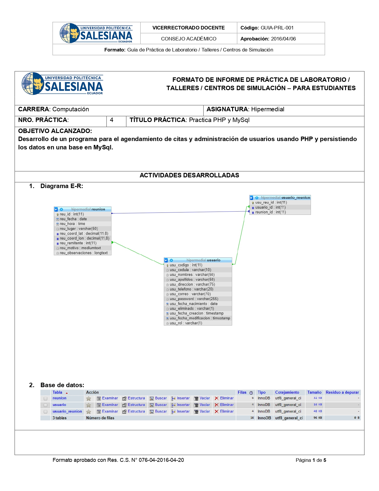
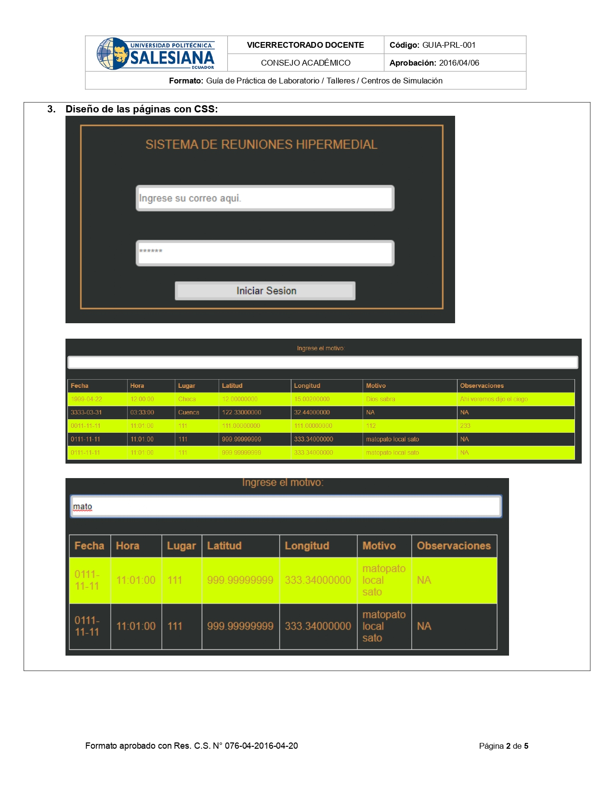
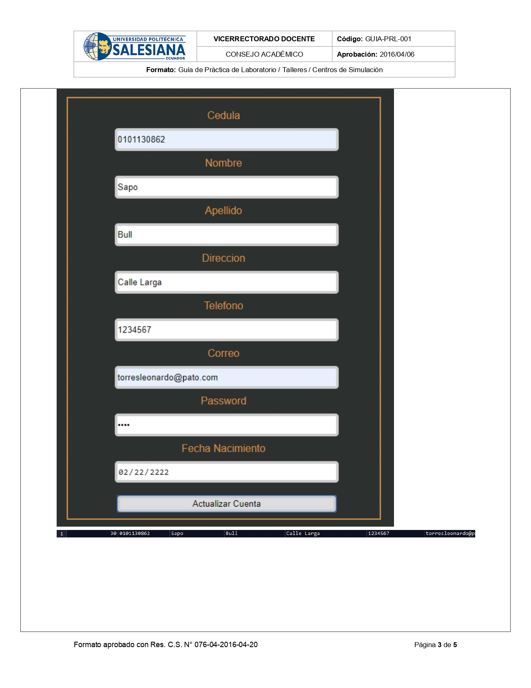
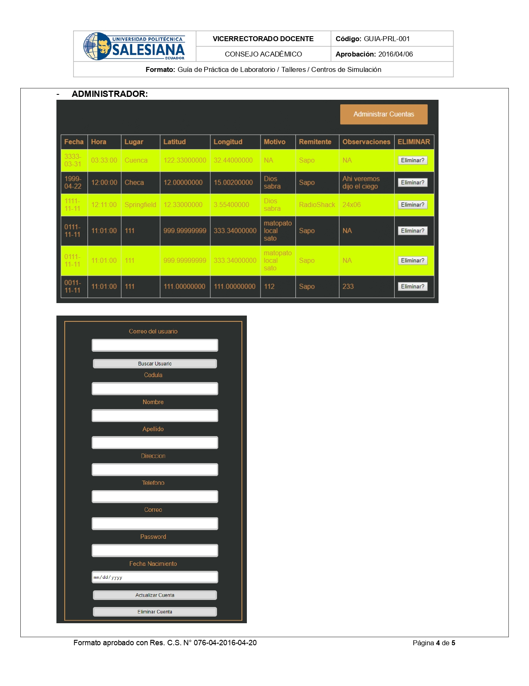
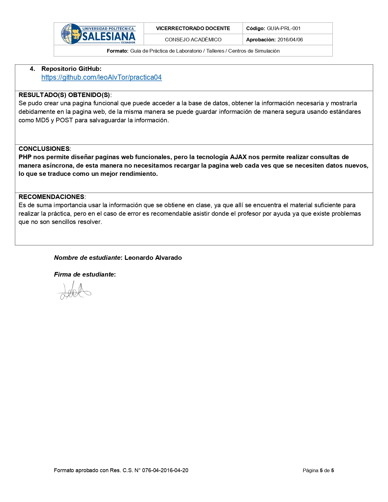

# Practica 04 #
#### Desarrollo de una aplicacion web usando PHP y MySql.

* Diagrama Entidad-Relacion y base de datos en XAMPP.

#### Imagenes sobre la pagina Web

*Logeo, reuniones y busqueda por motivo usando AJAX.

* Actualizacion de datos de la cuenta de usuario.

* Interfaz de administradores.

* Repositorio GitHub, conclusiones y recomendaciones.

